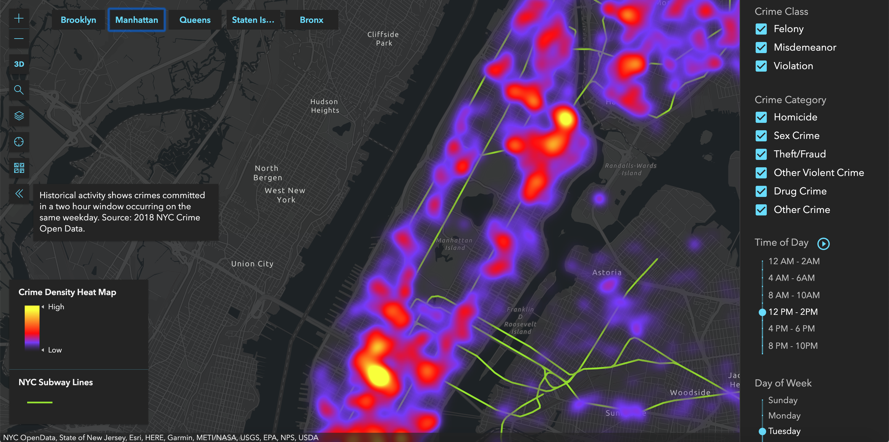

# VisualNYC

## Description

Interactive map of New York City featuring data visualizations of crime statistics based on NYC open data.

Map can be adjusted to display only crimes by: 1. time of day, 2. day of the week, 3. type of crime, etc.

Data is based off of NYC historical crime from beginning of 2018 until end of 2018.

This project will help users decide if their risk of crime when moving to or visiting a location and answer the age old question, is this area safe to be in? Example:

1.  Is it safe to walk in a neighborhood at 1am?
2.  Do I want to move to this neighborhood?
3.  Should I get an Uber or walk to the closest subway stop?
4.  Is this neighborhood safe to let my kid's go trick or treating?

## Tech Stack

1.  ArcGIS
2.  React.js
3.  redux.js
4.  Node.js
5.  Travis
6.  Git
7.  GitHub
8.  Heroku
